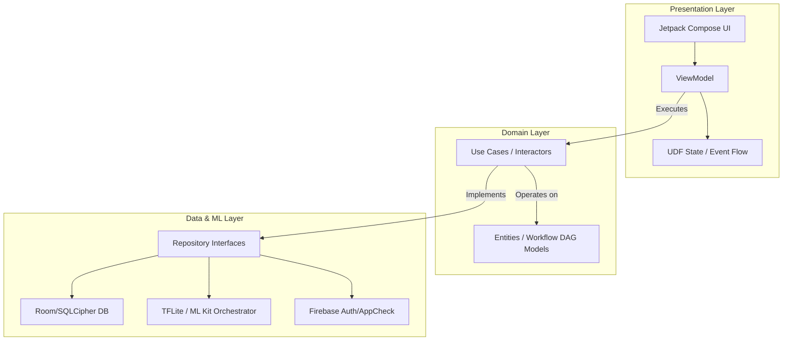

# FlowMind: A Secure, Natural Language-Driven No-Code Framework for Intelligent Mobile Automation and Edge AI Orchestration

## Abstract
**FlowMind** is a comprehensive, open-source Android platform (inspired by enterprise automation platforms like n8n) engineered to democratize complex Machine Learning (ML) workflows through a visual, no-code environment. By synthesizing Natural Language Processing (NLP) with Edge-Based Model Orchestration, FlowMind empowers end-users to dynamically build, execute, and monitor sophisticated automation tasks without programming expertise.

---

## 1. Core Capabilities & Innovations

1. **Intelligent Edge Orchestrator**: Dynamically evaluates the device's compute capabilities (RAM, Thermal State, Battery) to select the optimal model fallback mechanism (TensorFlow Lite $\rightarrow$ ML Kit $\rightarrow$ Cloud API).
2. **Natural Language-to-Workflow (NL2W)**: Features a robust intent-parsing engine that translates conversational prompts (e.g., *"Extract expenses from this receipt photo and export to CSV"*) into executable JSON-based workflow directed acyclic graphs (DAGs).
3. **Canvas-Based Visual Builder**: A fully interactive Jetpack Compose node-based canvas for manual drag-and-drop linking of Data Sources, Transforms, AI inference layers, and Output Actions.
4. **Zero-Trust Security Architecture**: 
   - Strict enforcing of Biometric/Cryptographic Unlocking.
   - Encrypted at-rest local database (Room + SQLCipher 4).
   - ADB Backup disabled by default and robust certificate pinning.

---

## 2. System Architecture

The repository enforces a strict, modular **Clean Architecture** combined with the **Model-View-ViewModel (MVVM)** design pattern, promoting decoupled, highly testable layers.

### Module Breakdown
* `auth/`: Handles zero-trust verification (Biometric Prompt, Firebase Auth, Keystore).
* `data/`: DAO schemas, AES-256 encrypted SQLite repository logic.
* `domain/`: Business logic, core workflow parsing, and execution validators.
* `ml/`: AI Model Orchestrator, NL Planner, Hardware State Evaluator.
* `ui/`: Node canvas, dashboard, routing via Compose Navigation.
* `worker/`: WorkManager and Foreground Services for long-running reliable automations.

---

## 3. Technology Stack

| Category | Technologies / Libraries Used |
| :--- | :--- |
| **Language** | Kotlin (1.9+) |
| **UI Framework** | Jetpack Compose (Material 3) |
| **Architecture** | MVVM, Clean Architecture |
| **Dependency Injection** | Hilt (Dagger) |
| **Database & Security** | Room, SQLCipher, AndroidX Security Crypto, Biometrics |
| **Machine Learning** | Google ML Kit (Vision/NLP), TensorFlow Lite (GPU Delegate), ONNX Runtime |
| **Cloud Services** | Firebase (Auth, AppCheck, Firestore) |
| **Concurrency & Async** | Kotlin Coroutines, Kotlin Flows, WorkManager |

---

## 4. Built-in Reference Workflows

The system ships with pre-compiled reference workflows demonstrating cross-domain versatility:
1. **Financial OCR Automaton**: `Camera Intent -> Vision OCR -> Regex Entity Extraction -> Categorization Model -> Local CSV Export`.
2. **Academic Synthesizer**: `Audio Recording -> Speech-to-Text (STT) -> Extractive Summarizer -> Flashcard Generation`.
3. **Botanical Diagnostics**: `Image Capture -> TFLite Image Classification (Flora) -> LLM Remediation Planner`.

---

## 5. Deployment & Compilation Instructions

1. Clone the repository: `git clone https://github.com/harshal-paltse/FlowMind.git`
2. Open the project in **Android Studio (Iguana or later)**.
3. Allow the Gradle Sync to complete (dependencies managed via `gradle/libs.versions.toml`).
4. **Firebase Configuration**: Insert a valid `google-services.json` file into the `app/` directory for authentication and cloud services.
5. Deploy to physical hardware (Recommended for TFLite GPU delegation testing) via `Shift + F10`.

---
## License
This project is licensed under the [MIT License](LICENSE).
